# Large Scale Integration Testing

> **Version**: 1.0.0
> **Last Updated**: 2026-01-23
> **Status**: 🟡 Template Operativo

---

## Panoramica

Questo documento descrive l'infrastruttura di test end-to-end per validare **tutte le funzionalità** di genro-mail-proxy in ambiente Docker. L'obiettivo è avere un sistema pronto all'uso per verificare il comportamento del servizio in scenari realistici.

---

## Architettura Test Infrastructure

```
┌───────────────────────────────────────────────────────────────────────────────────┐
│                            TEST INFRASTRUCTURE                                     │
├───────────────────────────────────────────────────────────────────────────────────┤
│                                                                                    │
│  ┌──────────────┐   ┌──────────────┐   ┌──────────────┐   ┌──────────────┐        │
│  │  PostgreSQL  │   │    MinIO     │   │   MailHog    │   │  Error SMTP  │        │
│  │   (db)       │   │   (S3-like)  │   │   (x2)       │   │   (x5)       │        │
│  │  port:5432   │   │  port:9000   │   │  1025/1026   │   │  1027-1031   │        │
│  └──────────────┘   └──────────────┘   └──────────────┘   └──────────────┘        │
│         │                  │                  │                  │                 │
│         └──────────────────┼──────────────────┴──────────────────┘                 │
│                            │                                                       │
│                   ┌────────▼────────┐                                              │
│                   │  MAIL-PROXY     │                                              │
│                   │   (service)     │                                              │
│                   │   port:8000     │                                              │
│                   └────────┬────────┘                                              │
│                            │                                                       │
│         ┌──────────────────┼──────────────────┐                                    │
│         │                  │                  │                                    │
│  ┌──────▼──────┐   ┌──────▼──────┐   ┌──────▼──────┐                              │
│  │ Echo Server │   │ Echo Server │   │ Attachment  │                              │
│  │  Tenant 1   │   │  Tenant 2   │   │  Server     │                              │
│  │  port:8081  │   │  port:8082  │   │  port:8083  │                              │
│  └─────────────┘   └─────────────┘   └─────────────┘                              │
│                                                                                    │
└───────────────────────────────────────────────────────────────────────────────────┘
```

### Error SMTP Servers

Fake SMTP servers che simulano vari tipi di errore per testare la logica di retry:

| Servizio | Porta | Comportamento |
|----------|-------|---------------|
| `smtp-reject` | 1027 | Rifiuta tutti i messaggi con errore 550 (permanente) |
| `smtp-tempfail` | 1028 | Errore temporaneo 451 (trigger retry) |
| `smtp-timeout` | 1029 | Risposta lenta (30s, simula timeout) |
| `smtp-ratelimit` | 1030 | Accetta i primi 3 messaggi, poi rifiuta con 452 |
| `smtp-random` | 1031 | Mix casuale: 60% success, 20% temp fail, 10% permanent, 10% slow |

### Servizi Docker

| Servizio | Immagine | Porta | Descrizione |
|----------|----------|-------|-------------|
| `db` | postgres:16-alpine | 5432 | Database PostgreSQL |
| `minio` | minio/minio | 9000/9001 | Object storage S3-compatible |
| `mailhog-tenant1` | mailhog/mailhog | 1025/8025 | SMTP + Web UI tenant 1 |
| `mailhog-tenant2` | mailhog/mailhog | 1026/8026 | SMTP + Web UI tenant 2 |
| `smtp-reject` | error-smtp | 1027 | SMTP che rifiuta tutto (550) |
| `smtp-tempfail` | error-smtp | 1028 | SMTP con errori temporanei (451) |
| `smtp-timeout` | error-smtp | 1029 | SMTP lento (simula timeout) |
| `smtp-ratelimit` | error-smtp | 1030 | SMTP con rate limiting |
| `smtp-random` | error-smtp | 1031 | SMTP con errori casuali |
| `client-tenant1` | mendhak/http-https-echo | 8081 | Echo server per delivery reports tenant 1 |
| `client-tenant2` | mendhak/http-https-echo | 8082 | Echo server per delivery reports tenant 2 |
| `attachment-server` | python:3.11-slim | 8083 | Server HTTP per allegati remoti |
| `mailproxy` | genro-mail-proxy:test | 8000 | Il servizio mail-proxy |

---

## Test Checklist

### Legenda
- ⬜ Non testato
- 🟢 Pass
- 🔴 Fail
- ⏭️ Skipped (dipendenza non disponibile)

---

## 1. CORE DISPATCH

### 1.1 Message Queue Management
| Test | Status | Note |
|------|--------|------|
| Enqueue single message | ⬜ | |
| Enqueue batch messages (10+) | ⬜ | |
| Deduplication by message_id | ⬜ | |
| Max batch size enforcement | ⬜ | |
| Invalid payload rejection | ⬜ | |

### 1.2 Message Processing
| Test | Status | Note |
|------|--------|------|
| Priority ordering (immediate > high > medium > low) | ⬜ | |
| Scheduled message delay | ⬜ | |
| Concurrent dispatch (global limit) | ⬜ | |
| Concurrent dispatch (per-account limit) | ⬜ | |
| Batch size per account | ⬜ | |

### 1.3 SMTP Delivery
| Test | Status | Note |
|------|--------|------|
| Simple text email | ⬜ | |
| HTML email | ⬜ | |
| Email with CC/BCC | ⬜ | |
| Email with Reply-To | ⬜ | |
| Custom headers | ⬜ | |
| Multiple recipients | ⬜ | |

### 1.4 Message States
| Test | Status | Note |
|------|--------|------|
| Pending → Sent transition | ⬜ | |
| Pending → Error transition | ⬜ | |
| Pending → Deferred transition | ⬜ | |
| Deferred → Sent (retry success) | ⬜ | |
| Sent → Reported transition | ⬜ | |

---

## 2. RETRY & ERROR HANDLING

### 2.1 SMTP Error Classification
| Test | Status | Note |
|------|--------|------|
| Temporary error (4xx) → retry | ⬜ | |
| Permanent error (5xx) → fail | ⬜ | |
| Connection timeout → retry | ⬜ | |
| Auth failure → fail | ⬜ | |
| TLS mismatch → fail | ⬜ | |

### 2.2 Retry Logic
| Test | Status | Note |
|------|--------|------|
| Exponential backoff delays | ⬜ | |
| Max retries enforcement | ⬜ | |
| Custom retry delays | ⬜ | |
| Retry count persistence | ⬜ | |

---

## 3. RATE LIMITING

### 3.1 Per-Account Limits
| Test | Status | Note |
|------|--------|------|
| Limit per minute | ⬜ | |
| Limit per hour | ⬜ | |
| Limit per day | ⬜ | |
| Defer behavior on limit hit | ⬜ | |
| Reject behavior on limit hit | ⬜ | |

### 3.2 Tenant Limits
| Test | Status | Note |
|------|--------|------|
| Tenant hourly limit | ⬜ | |
| Tenant daily limit | ⬜ | |

---

## 4. MULTI-TENANT

### 4.1 Tenant Management
| Test | Status | Note |
|------|--------|------|
| Create tenant via API | ⬜ | |
| Update tenant | ⬜ | |
| Deactivate tenant | ⬜ | |
| Delete tenant | ⬜ | |
| List tenants (active only filter) | ⬜ | |

### 4.2 Tenant Isolation
| Test | Status | Note |
|------|--------|------|
| Messages routed to correct SMTP | ⬜ | |
| Delivery reports to correct endpoint | ⬜ | |
| Tenant 1 cannot see Tenant 2 messages | ⬜ | |
| Per-tenant /run-now trigger | ⬜ | |

### 4.3 Tenant Authentication
| Test | Status | Note |
|------|--------|------|
| Bearer token auth for sync | ⬜ | |
| Basic auth for sync | ⬜ | |
| No auth for sync | ⬜ | |

---

## 5. DELIVERY REPORTS

### 5.1 Report Generation
| Test | Status | Note |
|------|--------|------|
| Report created on send success | ⬜ | |
| Report created on send failure | ⬜ | |
| Report contains correct status | ⬜ | |
| Report contains error details | ⬜ | |

### 5.2 Report Delivery
| Test | Status | Note |
|------|--------|------|
| HTTP POST to tenant sync_path | ⬜ | |
| Retry on HTTP failure | ⬜ | |
| Batch reports per tenant | ⬜ | |
| Global fallback URL | ⬜ | |

### 5.3 Report Cleanup
| Test | Status | Note |
|------|--------|------|
| Delete reported messages after retention | ⬜ | |
| Configurable retention period | ⬜ | |

---

## 6. ATTACHMENTS

### 6.1 Fetch Modes
| Test | Status | Note |
|------|--------|------|
| Base64 inline attachment | ⬜ | |
| HTTP URL attachment | ⬜ | |
| Filesystem attachment | ⬜ | |
| Endpoint (batch) attachment | ⬜ | |
| Auto-detect fetch mode | ⬜ | |

### 6.2 HTTP Fetcher
| Test | Status | Note |
|------|--------|------|
| Bearer auth | ⬜ | |
| Basic auth | ⬜ | |
| No auth | ⬜ | |
| Batch request to same server | ⬜ | |
| Fallback to single requests | ⬜ | |

### 6.3 Attachment Caching
| Test | Status | Note |
|------|--------|------|
| Memory cache hit | ⬜ | |
| Memory cache miss → fetch | ⬜ | |
| Disk cache hit | ⬜ | |
| Tiered cache (memory + disk) | ⬜ | |
| MD5 deduplication | ⬜ | |
| TTL expiration | ⬜ | |
| Size-based eviction | ⬜ | |

### 6.4 MIME Types
| Test | Status | Note |
|------|--------|------|
| Auto-detect from filename | ⬜ | |
| Explicit mime_type override | ⬜ | |
| Fallback to octet-stream | ⬜ | |

---

## 7. LARGE FILE STORAGE (S3/MinIO)

### 7.1 Configuration
| Test | Status | Note |
|------|--------|------|
| Enable large file storage per tenant | ⬜ | |
| Configure size threshold | ⬜ | |
| Configure storage URL (s3://) | ⬜ | |

### 7.2 Upload & Rewrite
| Test | Status | Note |
|------|--------|------|
| File > threshold uploaded to S3 | ⬜ | |
| Download link added to email body | ⬜ | |
| Original attachment removed | ⬜ | |
| Signed URL generation | ⬜ | |

### 7.3 Actions
| Test | Status | Note |
|------|--------|------|
| action=warn: log and send normally | ⬜ | |
| action=reject: fail message | ⬜ | |
| action=rewrite: upload and replace | ⬜ | |

### 7.4 Cleanup
| Test | Status | Note |
|------|--------|------|
| Expired files deleted (file_ttl_days) | ⬜ | |
| Post-download retention (lifespan_after_download_days) | ⬜ | |

---

## 8. DATABASE

### 8.1 PostgreSQL
| Test | Status | Note |
|------|--------|------|
| Connect to PostgreSQL | ⬜ | |
| Schema creation | ⬜ | |
| Connection pooling | ⬜ | |
| Concurrent writes | ⬜ | |
| Transaction handling | ⬜ | |

### 8.2 SQLite (comparison)
| Test | Status | Note |
|------|--------|------|
| All features work with SQLite | ⬜ | |

---

## 9. SMTP POOL

### 9.1 Connection Management
| Test | Status | Note |
|------|--------|------|
| Connection reuse | ⬜ | |
| TTL-based connection cleanup | ⬜ | |
| Max connections per account | ⬜ | |
| Health check on acquire | ⬜ | |
| Graceful shutdown | ⬜ | |

### 9.2 TLS Configuration
| Test | Status | Note |
|------|--------|------|
| Port 465 (implicit TLS) | ⬜ | |
| Port 587 (STARTTLS) | ⬜ | |
| use_tls flag handling | ⬜ | |

---

## 10. API

### 10.1 Authentication
| Test | Status | Note |
|------|--------|------|
| Valid token → access granted | ⬜ | |
| Invalid token → 403 | ⬜ | |
| No token configured → access granted | ⬜ | |

### 10.2 Endpoints
| Test | Status | Note |
|------|--------|------|
| GET /health (no auth) | ⬜ | |
| GET /status | ⬜ | |
| GET /metrics (Prometheus format) | ⬜ | |
| POST /messages/add | ⬜ | |
| GET /messages/all | ⬜ | |
| POST /messages/delete | ⬜ | |
| POST /messages/cleanup | ⬜ | |
| POST /accounts/add | ⬜ | |
| GET /accounts/list | ⬜ | |
| POST /accounts/delete | ⬜ | |
| POST /tenants/add | ⬜ | |
| GET /tenants/list | ⬜ | |
| GET /tenants/{id} | ⬜ | |
| POST /tenants/{id}/update | ⬜ | |
| POST /tenants/{id}/delete | ⬜ | |
| POST /run-now | ⬜ | |
| POST /suspend | ⬜ | |
| POST /activate | ⬜ | |

### 10.3 Validation
| Test | Status | Note |
|------|--------|------|
| Pydantic validation errors | ⬜ | |
| Missing required fields | ⬜ | |
| Invalid field types | ⬜ | |

---

## 11. PROMETHEUS METRICS

| Test | Status | Note |
|------|--------|------|
| Sent counter incremented | ⬜ | |
| Error counter incremented | ⬜ | |
| Deferred counter incremented | ⬜ | |
| Rate limited counter incremented | ⬜ | |
| Pending gauge updated | ⬜ | |
| Per-account labels | ⬜ | |

---

## 12. SERVICE CONTROL

| Test | Status | Note |
|------|--------|------|
| Start service (active=true) | ⬜ | |
| Suspend processing | ⬜ | |
| Activate processing | ⬜ | |
| Graceful shutdown | ⬜ | |
| Run-now trigger | ⬜ | |
| Run-now with tenant filter | ⬜ | |

---

## Esecuzione Test

### Prerequisiti

```bash
# Docker e Docker Compose
docker --version
docker compose version

# Python 3.10+
python --version
```

### Quick Start

```bash
# Dalla root del progetto
cd tests/docker

# Avvia l'infrastruttura
docker compose -f docker-compose.fulltest.yml up -d

# Attendi che tutti i servizi siano healthy
docker compose -f docker-compose.fulltest.yml ps

# Esegui i test
pytest ../test_fullstack_integration.py -v -m fullstack

# Arresta l'infrastruttura
docker compose -f docker-compose.fulltest.yml down -v
```

### Script Automatico

```bash
# Dalla root del progetto
./scripts/run-fullstack-tests.sh
```

### Opzioni

```bash
# Solo specifici test
pytest ../test_fullstack_integration.py -v -k "rate_limit"

# Con output dettagliato
pytest ../test_fullstack_integration.py -v -s

# Genera report HTML
pytest ../test_fullstack_integration.py --html=report.html
```

---

## Troubleshooting

### Servizi non partono

```bash
# Verifica logs
docker compose -f docker-compose.fulltest.yml logs mailproxy
docker compose -f docker-compose.fulltest.yml logs db

# Riavvia da zero
docker compose -f docker-compose.fulltest.yml down -v
docker compose -f docker-compose.fulltest.yml up -d --build
```

### MinIO non accessibile

```bash
# Verifica MinIO Console
open http://localhost:9001
# Credenziali: minioadmin / minioadmin

# Crea bucket manualmente se necessario
docker compose exec minio mc mb local/mail-attachments
```

### MailHog non riceve email

```bash
# Verifica UI MailHog
open http://localhost:8025  # Tenant 1
open http://localhost:8026  # Tenant 2

# Verifica connettività SMTP
telnet localhost 1025
```

### PostgreSQL connection refused

```bash
# Verifica che PostgreSQL sia pronto
docker compose exec db pg_isready -U mailproxy

# Controlla logs
docker compose logs db
```

---

## Aggiornamento Checklist

Dopo ogni run di test:

1. Aggiorna lo status (⬜ → 🟢 o 🔴)
2. Aggiungi note per test falliti
3. Commit del documento aggiornato

```bash
git add docs/large-scale-testing.md
git commit -m "test: update large-scale testing checklist"
```

---

## Riferimenti

- [Docker Compose File](../tests/docker/docker-compose.fulltest.yml)
- [Test Python](../tests/test_fullstack_integration.py)
- [Script Runner](../scripts/run-fullstack-tests.sh)
- [API Documentation](api_reference.rst)
- [Architecture](architecture_overview.rst)

---
---

# Appendice A: Architettura Dettagliata dell'Infrastruttura di Test

## A.1 Overview

L'infrastruttura di test su larga scala è progettata per validare **ogni aspetto** di genro-mail-proxy in un ambiente che simula fedelmente la produzione. Utilizza Docker Compose per orchestrare **13 servizi** interconnessi.

### Obiettivi

1. **Validazione end-to-end**: testare il flusso completo dalla ricezione API all'invio SMTP
2. **Simulazione errori**: verificare la resilienza con SMTP che simulano vari tipi di fallimento
3. **Multi-tenancy**: confermare l'isolamento tra tenant diversi
4. **Scalabilità**: testare con volumi significativi di messaggi
5. **Integrazioni**: validare storage S3, PostgreSQL, delivery reports

---

## A.2 Diagrammi Mermaid

### A.2.1 Architettura Generale


### A.2.2 Flusso di Invio Email


### A.2.3 Flusso Multi-Tenant

```mermaid
flowchart LR
    subgraph Tenant1["Tenant 1"]
        T1M[Messages]
        T1A[Account 1<br/>→MailHog T1]
        T1C[Client Endpoint<br/>:8081]
    end

    subgraph Tenant2["Tenant 2"]
        T2M[Messages]
        T2A[Account 2<br/>→MailHog T2]
        T2C[Client Endpoint<br/>:8082]
    end

    subgraph MailProxy["Mail Proxy"]
        CORE[Core Engine]
        ROUTER[Tenant Router]
    end

    T1M --> ROUTER
    T2M --> ROUTER
    ROUTER --> CORE

    CORE -->|SMTP| T1A
    CORE -->|SMTP| T2A
    CORE -->|Reports| T1C
    CORE -->|Reports| T2C
```



### A.2.4 Error SMTP Behavior


### A.2.5 Attachment Flow


---

## A.3 Dettaglio Servizi Docker

### A.3.1 Database - PostgreSQL

| Parametro | Valore |
|-----------|--------|
| **Immagine** | `postgres:16-alpine` |
| **Porta** | 5432 |
| **Database** | `mailproxy` |
| **User** | `mailproxy` |
| **Password** | `testpassword` |
| **Volume** | `pgdata:/var/lib/postgresql/data` |
| **Healthcheck** | `pg_isready -U mailproxy` |

**Scopo**: Storage primario per messaggi, account, tenant e configurazione.

### A.3.2 Object Storage - MinIO

| Parametro | Valore |
|-----------|--------|
| **Immagine** | `minio/minio` |
| **Porte** | 9000 (S3 API), 9001 (Console) |
| **Credenziali** | `minioadmin` / `minioadmin` |
| **Bucket** | `mail-attachments` |
| **Volume** | `minio-data:/data` |

**Scopo**: Storage S3-compatible per allegati di grandi dimensioni (large file storage).

**Console UI**: http://localhost:9001

### A.3.3 SMTP Servers - MailHog

| Servizio | SMTP Port | API Port | Tenant |
|----------|-----------|----------|--------|
| `mailhog-tenant1` | 1025 | 8025 | Tenant 1 |
| `mailhog-tenant2` | 1026 | 8026 | Tenant 2 |

**Scopo**: Cattura email per verifica. Ogni tenant ha il proprio server SMTP isolato.

**Web UI**:
- Tenant 1: http://localhost:8025
- Tenant 2: http://localhost:8026

**API**:
```bash
# Lista messaggi
curl http://localhost:8025/api/v2/messages

# Cancella tutti
curl -X DELETE http://localhost:8025/api/v1/messages
```

### A.3.4 Error SMTP Servers

Server custom basati su `aiosmtpd` che simulano vari comportamenti SMTP:

| Servizio | Porta | Error Mode | Comportamento |
|----------|-------|------------|---------------|
| `smtp-reject` | 1027 | `reject_all` | Risponde sempre `550 Mailbox not found` |
| `smtp-tempfail` | 1028 | `temp_fail` | Risponde sempre `451 Temporary failure` |
| `smtp-timeout` | 1029 | `timeout` | Attende 30s prima di rispondere |
| `smtp-ratelimit` | 1030 | `rate_limit` | Accetta i primi 3 msg, poi `452 Too many` |
| `smtp-random` | 1031 | `random` | Mix: 60% OK, 20% temp, 10% perm, 10% slow |

**Configurazione via Environment**:
```yaml
environment:
  - SMTP_ERROR_MODE=reject_all|temp_fail|timeout|rate_limit|random|none
  - SMTP_RATE_LIMIT=3        # Per rate_limit mode
  - SMTP_TIMEOUT_SECONDS=30  # Per timeout mode
```

### A.3.5 Echo Servers (Client Endpoints)

| Servizio | Porta | Tenant |
|----------|-------|--------|
| `client-tenant1` | 8081 | Tenant 1 |
| `client-tenant2` | 8082 | Tenant 2 |

**Immagine**: `mendhak/http-https-echo`

**Scopo**: Simulano gli endpoint dei client per ricevere i delivery reports. Rispondono con un echo del request ricevuto per verifica.

### A.3.6 Attachment Server

| Parametro | Valore |
|-----------|--------|
| **Immagine** | `python:3.11-slim` |
| **Porta** | 8083 |
| **Command** | `python -m http.server 8080` |
| **Volume** | `./test-attachments:/data:ro` |

**Scopo**: Serve file statici per testare il fetch di allegati via HTTP URL.

**File di test disponibili**:
- `small.txt` - File di testo piccolo
- `document.html` - Documento HTML

### A.3.7 Mail Proxy Service

| Parametro | Valore |
|-----------|--------|
| **Build** | `Dockerfile` nella root del progetto |
| **Porta** | 8000 |
| **Database** | PostgreSQL (via `GMP_DB_PATH`) |
| **API Token** | `test-api-token` |

**Environment Variables**:
```yaml
environment:
  - GMP_DB_PATH=postgresql://mailproxy:testpassword@db:5432/mailproxy
  - GMP_API_TOKEN=test-api-token
  - AWS_ACCESS_KEY_ID=minioadmin
  - AWS_SECRET_ACCESS_KEY=minioadmin
  - AWS_ENDPOINT_URL=http://minio:9000
```

---

## A.4 Network Configuration

Tutti i servizi sono connessi alla rete Docker `testnet`:

```yaml
networks:
  testnet:
    driver: bridge
```

**Comunicazione interna**: I servizi si raggiungono tramite il nome del container (es. `db`, `minio`, `mailhog-tenant1`).

**Porte esposte all'host**:

| Servizio | Porta Host | Porta Container |
|----------|------------|-----------------|
| PostgreSQL | 5432 | 5432 |
| MinIO S3 | 9000 | 9000 |
| MinIO Console | 9001 | 9001 |
| MailHog T1 SMTP | 1025 | 1025 |
| MailHog T1 API | 8025 | 8025 |
| MailHog T2 SMTP | 1026 | 1025 |
| MailHog T2 API | 8026 | 8025 |
| smtp-reject | 1027 | 1025 |
| smtp-tempfail | 1028 | 1025 |
| smtp-timeout | 1029 | 1025 |
| smtp-ratelimit | 1030 | 1025 |
| smtp-random | 1031 | 1025 |
| Echo T1 | 8081 | 8080 |
| Echo T2 | 8082 | 8080 |
| Attachment Server | 8083 | 8080 |
| Mail Proxy | 8000 | 8000 |

---

## A.5 Lista Completa dei Test

### A.5.1 Test Classes nel file `test_fullstack_integration.py`

| Classe | # Test | Descrizione |
|--------|--------|-------------|
| `TestHealthAndBasics` | 4 | Health endpoint, autenticazione API |
| `TestTenantManagement` | 4 | CRUD tenant via API |
| `TestAccountManagement` | 2 | Gestione account SMTP |
| `TestBasicMessageDispatch` | 4 | Invio email base (text, HTML, CC/BCC, headers) |
| `TestTenantIsolation` | 2 | Isolamento messaggi tra tenant |
| `TestBatchOperations` | 2 | Enqueue batch, deduplicazione |
| `TestAttachmentsBase64` | 1 | Allegati base64 inline |
| `TestPriorityHandling` | 1 | Ordinamento per priorità |
| `TestServiceControl` | 1 | Suspend/Activate |
| `TestMetrics` | 1 | Endpoint Prometheus |
| `TestValidation` | 2 | Validazione payload |
| `TestMessageManagement` | 2 | List/Delete messaggi |
| `TestInfrastructureCheck` | 5 | Verifica servizi Docker |
| `TestSmtpErrorHandling` | 4 | Errori SMTP (reject, tempfail, ratelimit, random) |
| `TestRetryLogic` | 2 | Retry count, error details |
| `TestLargeFileStorage` | 6 | Upload S3, rewrite link, reject, warn, mixed attachments |
| `TestTenantLargeFileConfigApi` | 3 | CRUD large_file_config via API |

**Totale: 46 test**

### A.5.2 Dettaglio Test per Categoria

#### Health & API Basics
```
test_health_endpoint_no_auth          - GET /health senza auth
test_status_endpoint_requires_auth    - GET /status richiede token
test_status_endpoint_with_auth        - GET /status con token valido
test_invalid_token_rejected           - Token invalido → 403
```

#### Tenant Management
```
test_create_tenant                    - POST /tenants/add
test_list_tenants                     - GET /tenants/list
test_get_tenant_details               - GET /tenants/{id}
test_update_tenant                    - POST /tenants/{id}/update
```

#### Message Dispatch
```
test_send_simple_text_email           - Email testo semplice
test_send_html_email                  - Email HTML
test_send_email_with_cc_bcc           - Email con CC e BCC
test_send_email_with_custom_headers   - Header personalizzati
```

#### Tenant Isolation
```
test_messages_routed_to_correct_smtp  - Routing corretto per tenant
test_run_now_with_tenant_filter       - /run-now con filtro tenant
```

#### SMTP Error Handling
```
test_permanent_error_marks_message_failed   - 550 → status error
test_temporary_error_defers_message         - 451 → status deferred
test_rate_limited_smtp_defers_excess        - 452 dopo N messaggi
test_random_errors_mixed_results            - Mix di risultati
```

#### Retry Logic
```
test_retry_count_incremented          - retry_count aumenta
test_message_error_contains_details   - last_error popolato
```

#### Large File Storage

```
test_small_attachment_sent_normally       - Allegato piccolo inviato normalmente
test_large_attachment_rewritten_to_link   - Allegato grande → upload S3 → link
test_large_attachment_reject_action       - action=reject → messaggio in errore
test_large_attachment_warn_action         - action=warn → inviato con warning
test_mixed_attachments_partial_rewrite    - Mix piccoli/grandi → rewrite parziale
test_verify_file_uploaded_to_minio        - Verifica upload su MinIO
```

#### Tenant Large File Config API

```
test_create_tenant_with_large_file_config - Crea tenant con large_file_config
test_update_tenant_large_file_config      - Aggiorna large_file_config
test_disable_large_file_config            - Disabilita large_file_config
```

### A.5.3 Markers pytest

```python
pytestmark = [pytest.mark.fullstack, pytest.mark.asyncio]
```

Per eseguire solo i test fullstack:
```bash
pytest -m fullstack
```

---

## A.6 Configurazione Test Tenants

I test creano automaticamente 2 tenant di test:

### Tenant 1
```json
{
  "id": "test-tenant-1",
  "name": "Test Tenant 1",
  "client_base_url": "http://client-tenant1:8080",
  "client_sync_path": "/proxy_sync",
  "client_auth": {"method": "none"},
  "active": true
}
```

Account SMTP:
```json
{
  "id": "test-account-1",
  "tenant_id": "test-tenant-1",
  "host": "mailhog-tenant1",
  "port": 1025,
  "use_tls": false
}
```

### Tenant 2
```json
{
  "id": "test-tenant-2",
  "name": "Test Tenant 2",
  "client_base_url": "http://client-tenant2:8080",
  "client_sync_path": "/proxy_sync",
  "client_auth": {"method": "bearer", "token": "tenant2-secret-token"},
  "active": true
}
```

Account SMTP:
```json
{
  "id": "test-account-2",
  "tenant_id": "test-tenant-2",
  "host": "mailhog-tenant2",
  "port": 1025,
  "use_tls": false
}
```

---

## A.7 Estensione dei Test

### Aggiungere un nuovo test

1. Identificare la classe appropriata o creare una nuova
2. Usare le fixture esistenti (`api_client`, `setup_test_tenants`)
3. Seguire il pattern esistente:

```python
async def test_new_feature(self, api_client, setup_test_tenants):
    """Descrizione del test."""
    ts = int(time.time())
    msg_id = f"new-feature-test-{ts}"

    # Setup
    message = {...}
    resp = await api_client.post("/messages/add", json={"messages": [message]})
    assert resp.status_code == 200

    # Action
    await trigger_dispatch(api_client)

    # Verify
    messages = await wait_for_messages(MAILHOG_TENANT1_API, 1)
    assert len(messages) >= 1
```

### Aggiungere un nuovo Error SMTP mode

1. Modificare `tests/docker/error-smtp/server.py`:

```python
elif self.error_mode == "new_mode":
    # Implementazione
    return "5xx Custom error"
```

2. Aggiungere servizio in `docker-compose.fulltest.yml`:

```yaml
smtp-newmode:
  build:
    context: ./error-smtp
  ports:
    - "1032:1025"
  environment:
    - SMTP_ERROR_MODE=new_mode
  networks:
    - testnet
```

3. Aggiungere costanti in `test_fullstack_integration.py`:

```python
SMTP_NEWMODE_HOST = "smtp-newmode"
SMTP_NEWMODE_PORT = 1032
```

---

## A.8 Performance e Limiti

### Risorse Docker raccomandate

- **CPU**: 4 core
- **RAM**: 8 GB
- **Disco**: 10 GB liberi

### Tempi di avvio

| Fase | Tempo stimato |
|------|---------------|
| Pull immagini (prima volta) | 2-5 min |
| Build mail-proxy | 30-60 sec |
| Startup servizi | 10-20 sec |
| Healthcheck completo | 30-60 sec |

### Limiti noti

- `smtp-timeout` con delay 30s può causare timeout nei test se non gestito
- MailHog non persiste i messaggi al restart
- MinIO in modalità standalone (non cluster)
